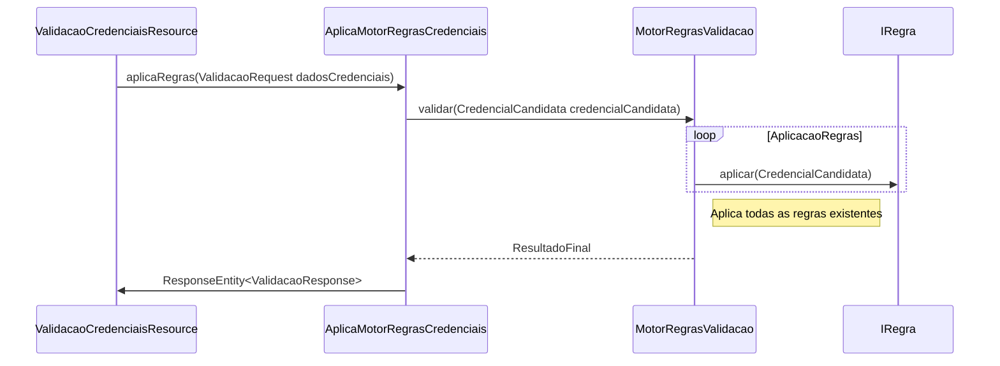

# Validação Credenciais API

## Desafio Backend Iti Digital Versão 1.0.0

Essa api foi criada para representar uma api de validação de senha, a qual possui certos critérios para ser válida.
Detalhes do desafio podem ser encontrados em [desafio-iti-digital-backend](https://github.com/itidigital/backend-challenge).

A seguir são apresentados informações sobre o endpoint criado e a forma criada para permitir a utilização da api.
O endpoint foi criado para trabalhar com o media type **application/json** tanto como entrada quanto saída.

1. Pré Requisitos
2. Como Rodar
3. Documentação do Endpoint
4. Entrada de Dados
5. Saída de Dados
6. Códigos HTTP utilizados
7. Chamada da API
8. Divisão pacotes

## Pré Requisitos 

A aplicação deve ser executada com o java na **versão 8** ou acima.

## Como Rodar

Para poder rodar subir a aplicação, deve-se executar o maven a partir da pasta raiz, e assim gerar o arquivo backend-challenge.jar.
Após gerado o arquivo jar, pode-se executar a aplicação indo na pasta `target` e executando o comando 
```shell 
java -jar backend-challenge.jar
```

Uma outra forma de rodar é executar o plugin **spring-boot-maven-plugin**. Também a partir da pasta raiz, execute o comando 
```shell 
mvn spring-boot:run
```
De ambas as formas a aplicação irá ser executada na porta **8080**.

## Documentação do Endpoint

Uma documentação mais detalhada do endpoint com exemplos é disponibilizada no diretório **target/generated-docs/api.html**
Para visualizar deve-se rodar um comando `mvn clean install`, o qual irá gerar o diretório e o documento resultante.

## Entrada de Dados

Para entrada deve-se enviar um objeto json com um atributo chamado *senha*, contendo a senha a ser validada.
Um exemplo de entrada é exemplificado a seguir:

```json
{
  "senha":"AbTp9!fok"
}
```

## Saída de Dados

Para a saída é retornado um objeto com um atributo nomeado **resultadoValidacao**, contendo o resultado da valiadação em formato booleano. 
Um exemplo de saída é exemplificado a seguir:

```json
{
  "resultadoValidacao": true
}
```

## Códigos HTTP utilizados
A seguir são apresentadas alguns *códigos http* utilizados na api e a explicação do que se referem.

* Código 200- Utilizado para indicar que a requisição foi retornada com sucesso.
* Código 412- Utilizado para indicar que a credencial não atende a todos os pré-requisitos.
  Em ambos os casos, será retornado um objeto com o atributo `resultadoValidacao`.

## Chamada da API

O endpoint de validação de credenciais pode ser chamado através do endereço `http://localhost:8080/api/api/v1/credenciais/validacao`, com o método http `POST`.
É necessário enviar um payload, contendo os campo senha.

Um exemplo do payload é exibido a a seguir:

```json
{
  "senha":"AbTp9!fok"
}
```

Caso a chamada ocorra com sucesso, será retornado o código `HTTP 200`, indicando que a senha é válida.

Requisição com sucesso
```
curl 'http://localhost:8080/api/v1/credenciais/validacao' -i -X POST \
    -H 'Content-Type: application/json' \
    -d '{"senha":"AbTp9!fok"}'
```
Resposta
```json
{
  "resultadoValidacao": true
}
```
```
HTTP/1.1 200 OK
Content-Type: application/json
Transfer-Encoding: chunked
Date: Tue, 21 Jun 2022 13:50:01 GMT
Keep-Alive: timeout=60
Connection: keep-alive
Content-Length: 27
{"resultadoValidacao":true}
```

Porém, caso a senha não preenche todos os pré-requisitos será retornado o código `HTTP 412`, indicando que a senha não é válida.

Requisição com erro
```
curl 'http://localhost:35653/api/v1/credenciais/validacao' -i -X POST \
    -H 'Content-Type: application/json' \
    -d '{"senha":"AbTp9!fok "}'
```
Resposta
```json
{
  "resultadoValidacao": false
}
```
```
HTTP/1.1 412 Precondition Failed
Content-Type: application/json
Transfer-Encoding: chunked
Date: Tue, 21 Jun 2022 13:50:01 GMT
Keep-Alive: timeout=60
Connection: keep-alive
Content-Length: 28

{"resultadoValidacao":false}
```

## Divisão Pacotes

Nessa seção serão apresentados os pacotes do projeto e a sua explicação

Todos os pacotes estão abaixo de **com.itidigital.backendchallenge**, portanto omitidos para melhor visualização.

* controller

Nesse pacote reside o endpoint propriamente dito `ValidacaoCredenciaisResource` e uma classe para lidar com o motor de regras de validação `AplicaMotorRegrasCredenciais`. Além disso, possui os DTO's `ValidacaoRequest` e `ValidacaoResponse` com respectivamente os campos de entrada e saída da aplicação.

* usecase

Contém o motor de regras `MotorRegrasValidacao`. Esse motor irá receber todas as implementações criadas da interface `IRegra` e irá aplicar cada uma. Por fim irá retornar um objeto da classe `ResultadoFinal` indicando o resultado da aplicação das regras de validação. Essa classe contém um status final e uma lista de eventuais erros `IIMensagemErro` caso o status seja `ERRO`.

Dessa forma apesar do exercício atual somente necessitar de um status booleano contendo se a credencial é válida ou não, o motor foi criado pensando na necessidade futura de se exibir os erros para o usuário final.

* domain

Contém as implementações das regras propriamente ditas. Para melhor legibilidade, foi incluído um pacote próprio para cada regra.

Junto de cada regra contém uma implementação da interface `IMensagemErro` pretendida para retornar um código internacionalizável do erro reportado pela regra.

Abaixo um diagrama de sequência do fluxo de validação



